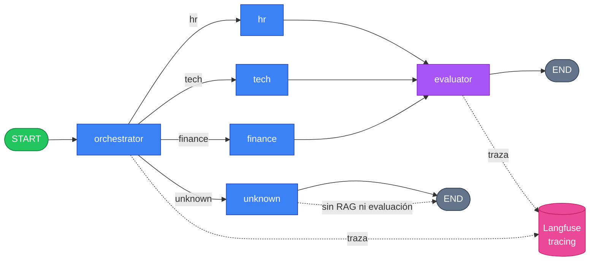

# Sistema Multi-Agente RAG con LangGraph

Sistema de routing inteligente para una empresa SaaS que clasifica
automáticamente las consultas entrantes por departamento (RR. HH., Soporte
Técnico, Finanzas) y las deriva a agentes RAG especializados. Un agente
orquestador clasifica la intención de cada consulta y, mediante enrutamiento
condicional con **LangGraph**, delega la respuesta al agente del dominio
correcto, que la fundamenta en la documentación interna de la empresa. Un agente
evaluador puntúa cada respuesta y todo el flujo queda trazado en **Langfuse**
para observabilidad y monitoreo de calidad.

## Arquitectura

```
Usuario pregunta
  → orquestador clasifica la intención (hr / tech / finance / unknown)
  → LangGraph enruta de forma condicional
  → agente RAG especializado recupera contexto de SU dominio (Chroma)
  → el LLM responde usando solo esos documentos (grounded)
  → evaluator puntúa la respuesta (LLM-as-judge)
  → Langfuse traza todo el flujo y registra los scores
```



### Cómo viaja una consulta

1. El usuario envía una consulta (CLI: `--query` o modo interactivo).
2. El **orquestador** la clasifica con el LLM (salida estructurada) en `hr`, `tech`,
   `finance` o `unknown`.
3. **LangGraph** enruta condicionalmente al nodo correspondiente.
4. El **agente especialista** convierte la consulta en un vector y recupera de
   **Chroma** los chunks más relevantes de su dominio (k=4).
5. El **LLM** redacta la respuesta usando exclusivamente ese contexto (grounding).
6. El **evaluator** (LLM-as-judge) puntúa la respuesta.
7. **Langfuse** traza todo el recorrido y registra los scores.

> Las consultas `unknown` cortan antes: responden sin RAG ni evaluación.

## Stack tecnológico

| Capa | Tecnología |
|---|---|
| Lenguaje / entorno | Python 3.12 · uv |
| Orquestación multi-agente | LangGraph |
| Framework LLM | LangChain |
| LLM y embeddings | OpenAI (`gpt-4o-mini` · `text-embedding-3-small`) |
| Vector store | Chroma |
| Observabilidad | Langfuse |
| Validación / datos estructurados | Pydantic |

## Estructura del proyecto

```
HENRY_M3_PI/
├── data/                       # Bases de conocimiento (3 dominios, .md)
│   ├── hr_docs/                # ~86 chunks
│   ├── tech_docs/              # ~91 chunks
│   └── finance_docs/           # ~90 chunks
├── src/
│   ├── config.py               # configuración central (claves, rutas, parámetros)
│   ├── rag.py                  # RAG: load → chunk → embeddings → retriever
│   ├── vectorstore.py          # abstracción del vector store (Chroma)
│   ├── agents.py               # router (orquestador) + nodos especialistas
│   ├── evaluator.py            # nodo evaluator (LLM-as-judge)
│   ├── langfuse_setup.py       # observability (callback + scores)
│   ├── graph.py                # grafo LangGraph + ruteo condicional
│   └── main.py                 # CLI (--query, --validate, interactivo)
├── test_queries.json           # 12 consultas de prueba con intención esperada
├── requirements.txt            # dependencias
├── .env.example                # plantilla de variables de entorno
└── README.md
```

## Instalación

### Opción A — con uv (recomendado)

```bash
git clone <repo-url>
cd HENRY_M3_PI
uv sync                 # crea el entorno e instala las dependencias
```

### Opción B — con pip

```bash
python -m venv .venv
source .venv/bin/activate        # en Windows: .venv\Scripts\activate
pip install -r requirements.txt
```

### Configurar las API keys

Copiá la plantilla y completá tus claves:

```bash
cp .env.example .env
```

Editá `.env`:

```env
OPENAI_API_KEY=sk-...
LANGFUSE_PUBLIC_KEY=pk-lf-...
LANGFUSE_SECRET_KEY=sk-lf-...
LANGFUSE_HOST=https://cloud.langfuse.com   # o https://us.cloud.langfuse.com
OPENAI_MODEL=gpt-4o-mini
OPENAI_EMBEDDING_MODEL=text-embedding-3-small
```

- `OPENAI_API_KEY` es necesaria para embeddings, respuestas y evaluación.
- Las claves de Langfuse son opcionales: sin ellas el sistema corre igual, solo
  que no trazea (degradación elegante).

## Cómo ejecutar

Con uv anteponé `uv run`; con pip activá el entorno y usá `python`.

```bash
# Validar el proyecto (cuenta chunks por dominio y chequea el ruteo, sin Chroma)
uv run python -m src.main --validate

# Ejecutar una consulta
uv run python -m src.main --query "¿Cuántos días de vacaciones tengo con 5 años?"

# Modo interactivo (loop hasta escribir 'salir')
uv run python -m src.main
```

> La primera consulta construye las colecciones Chroma (hace embeddings de los
> documentos) y las persiste en `chroma_db/`. Las siguientes corridas las reusan.

## Validación

El comando `--validate` comprueba el proyecto sin construir la base Chroma:

- **Chunks por dominio** (mínimo 50): HR 86 · Tech 91 · Finanzas 90.
- **Ruteo**: 12/12 consultas de `test_queries.json` clasificadas correctamente
  (cubre `hr`, `tech`, `finance` y casos `unknown`/ambiguos).

```bash
uv run python -m src.main --validate
```

## Ejemplos de uso

Cuatro consultas reales que muestran el ruteo, la respuesta fundamentada y la evaluación automática:

---

**IT / Soporte Técnico**

❓ Pregunta: *Necesito cambiar mi contraseña del correo corporativo*
🧭 Ruteo: orchestrator → `tech`
💬 Respuesta:
> Para cambiar la contraseña de tu correo corporativo:
> 1. Ingresá al portal de identidad corporativa con tu usuario y contraseña actual.
> 2. Entrá a Seguridad → Cambiar contraseña.
> 3. Escribí la contraseña actual y la nueva (mínimo 12 caracteres: letras, números y símbolos).
> 4. Confirmá con el segundo factor (MFA) y guardá los cambios.

📄 Fuentes: `seguridad_contrasenas.md`
⭐ Evaluación: overall 10 (relevance 10 · completeness 10 · accuracy 10 · clarity 10)

---

**Recursos Humanos**

❓ Pregunta: *¿Puedo trabajar desde otro país y por cuánto tiempo?*
🧭 Ruteo: orchestrator → `hr`
💬 Respuesta:
> Podés trabajar temporalmente desde otro país por un máximo de 30 días corridos por año sin trámites adicionales. Para estadías mayores, se requiere aprobación de People Operations y del área Legal.

📄 Fuentes: `trabajo_remoto_hibrido.md`
⭐ Evaluación: overall 9 (relevance 10 · completeness 8 · accuracy 10 · clarity 9) — respuesta correcta, pero el evaluator la marca como algo incompleta.

---

**Finanzas**

❓ Pregunta: *¿Cuándo se acredita un reembolso de gastos aprobado?*
🧭 Ruteo: orchestrator → `finance`
💬 Respuesta:
> El reembolso se acredita junto con el salario: si se aprueba antes del día 20 del mes, en ese mes; si no, en el siguiente.

📄 Fuentes: `reembolsos.md`, `reportes_gastos.md`
⭐ Evaluación: overall 10 (relevance 10 · completeness 10 · accuracy 10 · clarity 10)

---

**Fuera de dominio (unknown)**

❓ Pregunta: *¿Cuál es la capital de Francia?*
🧭 Ruteo: orchestrator → `unknown` (corta a END, sin RAG ni evaluación)
💬 Respuesta:
> No tengo documentación interna suficiente para responder esa consulta. Puedo ayudarte con RR. HH., soporte técnico (IT) o finanzas.

---

## Evaluación y observabilidad

Dos capas integradas en el flujo (no son pasos opcionales):

- **Evaluación automática del RAG (LLM-as-judge).** Cada respuesta es puntuada por
  un segundo modelo en varias dimensiones (`relevance`, `completeness`, `accuracy`,
  `clarity` y un `overall`). Los scores aparecen en cada ejemplo de arriba y sirven
  para detectar respuestas de baja calidad antes de que lleguen al cliente.
- **Observabilidad con Langfuse.** Todo el recorrido de cada consulta queda trazado
  (orchestrator → retrieval → respuesta → evaluación). En el dashboard se inspecciona
  el execution path completo —clasificación, chunks recuperados, prompts, latencia y
  tokens— y los scores del evaluator quedan asociados a cada traza como *Scores*
  nativos. Permite depurar una misclassification o un retrieval fallido sin adivinar.

> Ambas se activan solas: la evaluación corre en cada consulta; el tracing se
> habilita al cargar las claves de Langfuse en `.env`.

---

## Decisiones técnicas

- **Orquestación con enrutamiento condicional.** Separo *decidir a qué
  especialista mandar la consulta* de *responderla*: un orquestador clasifica y
  el grafo enruta condicionalmente al agente correcto. Elegí LangGraph sobre una
  cadena lineal porque deja el ruteo explícito y permite sumar un dominio nuevo
  agregando un nodo, sin reescribir el flujo.
- **Clasificación con salida estructurada.** El orquestador no devuelve texto
  libre: fuerza al modelo a producir una decisión validada (una intención de un
  conjunto cerrado). Esto hace el ruteo confiable y predecible, e incluye una
  categoría `unknown` para no responder consultas ambiguas o fuera de dominio
  (mejor decir "no es mi área" que contestar mal).
- **Conocimiento aislado por dominio.** Cada agente tiene su propia base de
  conocimiento y solo busca ahí. Es la decisión central del proyecto: evita que
  el agente de RR. HH. responda con un documento de Finanzas y ataca directamente
  el problema de las consultas mal enrutadas.
- **Respuestas fundamentadas (grounding).** Los agentes responden únicamente con
  los fragmentos recuperados de la documentación; si la información no está, lo
  dicen en vez de inventar. Reduce alucinaciones y asegura que las respuestas
  reflejen las políticas reales de la empresa.
- **Búsqueda semántica persistente.** Las consultas se resuelven por *significado*
  (embeddings), no por coincidencia exacta de palabras. Elegí Chroma sobre FAISS
  porque persiste en disco y maneja una colección por dominio sin código extra; a
  esta escala el rendimiento es equivalente, así que prioricé la simplicidad.
- **Modularidad del vector store.** La lógica del vector store está encapsulada en
  una clase (`VectorStore`) con una interfaz mínima; cambiar de proveedor (FAISS,
  Qdrant, etc.) implica reescribir un solo archivo, sin tocar los agentes ni el grafo.
- **Control de calidad automático (LLM-as-judge).** Un segundo modelo evalúa cada
  respuesta antes de que llegue al cliente y detecta cuándo el agente se desvía
  del contexto. Convierte la calidad en algo medible, no en una impresión.
- **Observabilidad de extremo a extremo.** Todo el recorrido de cada consulta
  queda trazado en Langfuse, lo que permite depurar una mala clasificación o un
  retrieval fallido inspeccionando el flujo completo, en lugar de adivinar.

## Extender el sistema

Agregar un dominio nuevo (por ejemplo, Legal) es un cambio local:

1. Crear `data/legal_docs/` con sus documentos (≥50 chunks).
2. Sumar `"legal"` al mapa `DOMAIN_DIRS` en `src/config.py`.
3. Agregar el intent `legal`, su nodo en `src/agents.py` y registrarlo en el grafo
   (`src/graph.py`) con su arista condicional.

La arquitectura de grafo y la abstracción del vector store mantienen el cambio
aislado: no hay que tocar la lógica de los demás agentes.

## Notas de configuración

- **Todo configurable en un lugar.** `chunk_size`, `chunk_overlap` y `retriever_k`
  se ajustan en `src/config.py`; los modelos, vía `.env` (`OPENAI_MODEL`,
  `OPENAI_EMBEDDING_MODEL`) sin tocar código.
- **Re-indexar después de cambios.** Las colecciones Chroma se construyen una sola
  vez y se reusan. Si modificás los documentos de `data/` o los parámetros de
  chunking, borrá `chroma_db/`; si no, el sistema sigue usando las colecciones
  viejas.
- **Región de Langfuse.** `LANGFUSE_HOST` debe coincidir con la región de tu
  proyecto: `https://cloud.langfuse.com` (UE) o `https://us.cloud.langfuse.com`
  (US). Si no coincide, la autenticación falla.

## Limitaciones conocidas

- **Tres dominios.** Solo responde sobre RR. HH., IT y Finanzas; el resto cae en
  `unknown`. Sumar un dominio implica agregar sus documentos y un nodo al grafo.
- **Calidad atada a los documentos.** El sistema es tan bueno como su base de
  conocimiento: si la información no está en `data/`, el agente lo dice en vez de
  inventar (como pasó con el procedimiento de cambio de contraseña).
- **Sin memoria conversacional.** Cada consulta es independiente; no recuerda
  preguntas anteriores ni mantiene un diálogo de varios turnos.
- **Ruteo y retrieval no son perfectos.** Consultas en el límite entre dominios
  pueden caer en `unknown`, y el retrieval (top-4 por similitud) puede dejar afuera
  un chunk relevante si no quedó entre los más cercanos.
- **Evaluador orientativo.** El LLM-as-judge es una guía de calidad, no un juicio
  infalible; tiende a ser generoso con respuestas bien fundamentadas.
